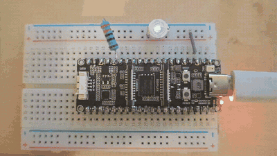

<div align="center">
  <picture>
    <source media="(prefers-color-scheme: dark)" srcset="assets/logo-dark.svg">
    <source media="(prefers-color-scheme: light)" srcset="assets/logo-light.svg">
    
  </picture>
</div>

<p align="center">
  <a href="LICENSE"></a>
  
  
  
  <a href="https://github.com/php-baremetal/php-esp32/stargazers"></a>
</p>

# PHP on ESP32

> **A quick heads-up on the project's pace.**
>
> If you've followed this from the start, you know it began as something to fill my time over the
> holidays. The holidays are now over. **This does not mean the project is dead or parked** — it means
> the release cycles will be a bit longer from here on. I fully intend to keep growing it, and the
> interest is still very much there. There's a **[roadmap](ROADMAP.md)** laying out how I want to
> structure and carry the project forward from now on. **New contributors are very welcome.**

Run the real PHP interpreter on a microcontroller. Not a lookalike, not a language subset, not a
transpiler: the official Zend engine from php.net, cross-compiled for the chip, executing your
`index.php` opcode by opcode the same way it would behind a web server.

You write PHP, put it on the board (on a microSD card or baked into the firmware image), and the chip
runs it. Change the script, reset, and it runs the new one. There is no host computer, no operating
system underneath, and no interpreter of our own invention in the middle.

## Real PHP, not a reimplementation

The engine is the unmodified release from [php.net](https://www.php.net/) (the default is `php-8.4.25`,
sha256 verified; 8.3 and 8.5 build too). The source tree is vendored exactly as it ships and is never edited in place; every
adjustment the target needs is a separate patch applied at build time. The whole Zend Engine is
compiled in: the lexer, the parser and the opcode compiler, the virtual machine and executor, the
garbage collector and memory manager, and the object, class and exception model. `<?php echo 1 + 1;`
travels the same path here as on a server, from source to tokens to syntax tree to opcodes to
execution.

It runs as native code, not under emulation. PHP's C is built with the chip's own cross-compiler
(`riscv32-esp-elf` for the ESP32-P4, `xtensa-esp32s3-elf` for the ESP32-S3) and the opcodes execute
on the board's CPU. There is no hidden second processor and no instruction emulator. The integration
point is the official `embed` SAPI, the same interface any C program uses to host PHP.

The standard library comes with it: `ext/standard` (strings, arrays, math, `var_dump`), PCRE, JSON,
hashing, SPL, reflection and the CSPRNG. `array_map`, `preg_match`, `json_encode` and `hash` do
exactly what they do everywhere else, because they are the same code. Optional extensions layer on
top per project (see below), alongside a small GPIO extension for driving pins.

Hand the same `index.php` to this engine or to a desktop `php` and you get the same output, because
underneath it is the same interpreter.

## Supported hardware

Two properties decide whether a chip can run this. The first is external PSRAM: the runtime heap is
measured in megabytes and will not fit in a few hundred KB of internal SRAM. The second is room in
flash, 8 MB and up, because the firmware image is around 3 MB. Core architecture does not matter (the
portable "call" virtual machine builds on both Xtensa and RISC-V), and clock speed changes how fast
it runs, not whether it runs.

Two chip families are supported today:

| Family | Core | Boards | Networking | Notes |
|---|---|---|---|---|
| **ESP32-P4** | dual-core RISC-V, up to 400 MHz | P4-Zero, P4-Pico, P4-ETH, P4-WiFi-C6 | Ethernet on P4-ETH (RMII + IP101 PHY); **WiFi 6 on P4-WiFi-C6** (on-board ESP32-C6 companion over ESP-HOSTED); Pico/Zero have none | up to 32 MB PSRAM; enough headroom to run full frameworks |
| **ESP32-S3** | dual-core Xtensa LX7, 240 MHz | S3-Zero, S3-Pico, S3-ETH | Ethernet on S3-ETH (W5500 over SPI); Pico/Zero have none | 8 MB PSRAM; runs plain apps, and a live web server on S3-ETH |

Within each family, `-ETH` adds a wired network, `-Pico` is the same board without it (microSD +
embedded), and `-Zero` is the minimal variant: embedded-only, no microSD slot. The ESP32-P4 has no
native radio, so `esp32-p4-wifi-c6` is a **special board** that adds WiFi through an on-board companion
chip (see [docs/reference/special-boards.md](docs/reference/special-boards.md)).

More of the ESP32 line will follow. Any part with PSRAM and a reasonable flash is a candidate, and a
new family is a directory under `boards/`, not a change to the engine. The parts without PSRAM (the C
and H series) are out regardless of clock speed: the heap has nowhere to live.

PHP **8.3** (8.3.33), **8.4** (8.4.25) and **8.5** (8.5.10) are all built today, selectable per project (`-DPHP_VERSION=<ver>`). The tree keeps everything version-specific under
`components/php/versions/<version>/`, so further releases slot in beside them as they are ported.

## Getting started

The supported path is [`phpflash`](https://github.com/php-baremetal/flash-tool), a single-binary CLI
that scaffolds a project, drives the ESP-IDF build, flashes the board and opens the serial console. It
reads what the firmware can actually build (boards, extensions, storage and execution models) from the
installed php-esp32, so it only ever offers real options.

```sh
# install the CLI (Linux; the phpflash repo covers other platforms and building from source)
curl -LO https://github.com/php-baremetal/flash-tool/releases/latest/download/phpflash-linux-amd64
chmod +x phpflash-linux-amd64 && sudo mv phpflash-linux-amd64 /usr/local/bin/phpflash

phpflash system-setup           # once: installs ESP-IDF and the php-esp32 firmware sources
phpflash init my-project        # scaffold a project (asks for board, storage, extensions)
cd my-project
$EDITOR project-src/index.php    # write your PHP
phpflash build                  # build the firmware
phpflash flash                  # flash the connected board
phpflash monitor                # watch the serial output
```

`init` is interactive with a sensible default at every step. Its board and extension prompts are read
live from the firmware, so a networked board offers the web-server model and each board offers exactly
the extensions its build supports. The full walkthrough, covering both storage layouts and both
execution models, is in [docs/getting-started/quick-start.md](docs/getting-started/quick-start.md).

Not sure which board is plugged in? `phpflash discover` identifies the chip and lists the boards that
match it; `phpflash discover --all` flashes a probe firmware that brings up the Ethernet link and
mounts the card to name a blank board. Building by hand with ESP-IDF is still possible and documented,
but phpflash is the shorter road.

## Writing PHP for the board

There are two execution models, chosen per project.

**Linear, or setup and loop.** A script can run start to finish, or follow the Arduino-style pattern:
`setup()` runs once, then `loop($tick)` is called repeatedly. The loop itself lives in C, which gives
it a place to do memory housekeeping and to yield to the watchdog; PHP supplies the two functions.

```php
<?php
// index.php: blink an LED on GPIO2.
define('LED', 2);

function setup(): void {
    gpio_mode(LED, GPIO_OUTPUT);
    echo 'PHP ' . PHP_VERSION . " up\n";
}

function loop(int $tick): void {
    gpio_write(LED, $tick % 2);   // on for odd ticks, off for even
    delay(500);                    // milliseconds
}
```

`gpio_mode`, `gpio_write`, `gpio_read` and `delay` come from a small built-in extension. `delay`
yields the core through `vTaskDelay` instead of busy-waiting, so the watchdog stays satisfied, and
`echo` goes to the serial console. A project can add its own native functions the same way, by
dropping a C extension under `./firmware/exts/` -- see
[docs/extensions/custom-extensions.md](docs/extensions/custom-extensions.md). Here is that sketch on real hardware, three
lines of PHP driving a physical pin:



**Web server.** On a board with Ethernet the firmware can run an HTTP server and hand each request to
a fresh PHP run, the way a script runs behind Apache or PHP-FPM. The entry script produces the page;
whatever it prints becomes the response body, and `$_SERVER`, `$_GET`, `$_POST`, cookies and sessions
are populated per request. This is what makes a framework browsable: on the ESP32-P4, stock Laravel
and Symfony both serve pages this way. And because every ESP32-S3 has WiFi on the die, a board can even
create its own network and serve the page over it -- no router, no cable: [`wifi-ap-s3-rgb-manage`](examples/wifi-ap-s3-rgb-manage/)
starts a WiFi access point and serves a live PHP page that controls the board's onboard RGB LED from your phone.

**Where the code lives.** Also per project. A `microsd` project reads its source from a FAT card, so
to change what runs you pull the card, edit the files from your PC, put it back and reset, with no
rebuild. An `embedded` project bakes a read-only copy of the source into the firmware image, so the
board needs no card at all; a microSD can still be mounted alongside it for writable data. The flash
partition layout follows this choice, generated per build: an embedded image is sized to its source,
a microSD project carries none of it, leaving that flash free.

Ready-made sketches live in [`examples/`](examples/), one per folder.

## What runs on it

The standard library is always on. Everything else is opt-in per project; phpflash enables an
extension from the firmware's manifest and pulls any extra sources it needs.

- **Language.** Classes, closures, generators, exceptions, traits, namespaces, typed properties,
  enums and attributes are all present, because they are the engine rather than a library on top of it.
- **Text and data.** `ctype`, `mbstring` (with optional oniguruma for `mb_ereg`), `filter`,
  `tokenizer`, and PDO SQLite for an on-card or in-memory database.
- **Time.** `date` brings the `DateTime` family and timezone support; a minimal UTC stub covers the
  few core call sites when the full extension is off.
- **State.** `session` for per-visitor state on the web-server model; a reboot-persistent key-value
  store (`store_set` / `store_get`, backed by the chip's NVS) for values that must survive a reset,
  like a boot counter or a device identity; and a volatile in-RAM twin (`mem_set` / `mem_get`) for
  data shared across the requests of one boot without touching flash. On the web-server model a
  one-time `[web-server] init` script does setup once, before serving. See [docs/storage/persistent-store.md](docs/storage/persistent-store.md)
  and [docs/storage/in-ram-store.md](docs/storage/in-ram-store.md).
- **Configuration.** A project `.env` next to the config is baked into the firmware and read as
  `$_ENV` / `getenv()`, so endpoints, flags and device names live in configuration rather than in the
  script -- and not on the removable card. See [docs/storage/environment.md](docs/storage/environment.md).
- **OPcache.** The bundled Zend OPcache is ported (no JIT, statically linked). It caches compiled
  bytecode to the card or into PSRAM, so a request stops recompiling the framework every time.
- **TLS.** The `openssl` extension has two builds: a compact one backed by the chip's mbedTLS, and the
  full OpenSSL 3.0 (RSA, EC, X.509). On a networked board it drives an HTTPS client.
- **Frameworks.** With the web-server model and OPcache, the ESP32-P4 (32 MB PSRAM) runs stock Laravel
  and Symfony. The ESP32-S3 (8 MB) runs plain applications and a live web server, but not a full
  framework: the container-compile step alone needs more RAM than it has. That is a memory ceiling,
  not a language limit.
- **Not present.** Processes, and `Fiber` (which would need 32-bit context-switch assembly that does
  not exist for these targets). Both follow from the hardware.

The per-extension status, with the build flag and any settings for each, is in
[docs/extensions/porting-status.md](docs/extensions/porting-status.md).

## How it is built

PHP's own build system is not used. `./configure` runs probe programs that cannot execute on the
target, and some steps run the freshly built binary, which here is a cross-compiled executable that
will not run on the host. In its place is an ESP-IDF component with a hand-written `CMakeLists.txt`
and `php_config.h`. Everything links statically: no `dl()`, no shared extensions. The entry point is
the `embed` SAPI.

```
php-esp32/
├── php-esp32.toml            repo descriptor: default PHP version and board
├── CMakeLists.txt            top level: selects the board and PHP version, pins the target
├── cmake/resolve-board.cmake board resolution, shared by the top level and main
├── sdkconfig.defaults        base config (board-agnostic: task stack, FAT long names)
├── scripts/
│   ├── fetch-php.sh          downloads, verifies and patches the PHP source
│   ├── fetch-sqlite.sh · fetch-oniguruma.sh · fetch-openssl.sh   optional sources, on demand
│   └── info.sh               what this checkout can build (versions, boards, modes)
├── boards/                   one directory per chip family, then per board
│   ├── esp32-p4/             family: target and PSRAM (sdkconfig.family, family.toml)
│   │   ├── esp32-p4-zero/    board: embedded-only, no microSD, no network
│   │   ├── esp32-p4-pico/    board: pins and mount code (board.c/.h), sdkconfig, partitions
│   │   ├── esp32-p4-eth/     board: adds the wired Ethernet
│   │   └── esp32-p4-wifi-c6/   board: adds WiFi via an on-board ESP32-C6 (ESP-HOSTED)
│   └── esp32-s3/
│       ├── esp32-s3-zero/    board: embedded-only, no microSD, no network
│       ├── esp32-s3-pico/    board: SD over SPI, no network
│       └── esp32-s3-eth/     board: SD over SPI, Ethernet over a W5500
├── main/                     boot: mounts storage and network via the board, starts the engine
├── components/
│   ├── php/
│   │   ├── CMakeLists.txt     generic: builds the selected PHP version
│   │   ├── compat/            shared POSIX stubs (posix_stubs, syslog, opcache backends)
│   │   ├── versions/8.4.25/   per-version: sources.cmake, config headers, patches, manifest.toml
│   │   └── php-8.4.25/        the PHP source (fetched, not committed)
│   ├── php_ext_gpio/          the gpio_* and delay extension
│   ├── php_ext_store/         the store_* reboot-persistent key-value store (NVS)
│   ├── php_ext_mem/           the mem_* volatile in-RAM key-value store
│   └── php_project_exts/      compiles a project's own C extensions from ./firmware/exts/
├── examples/                 example projects, one per folder
├── docs/                     architecture, porting notes, footprint, extensions, and more
└── resources/                board datasheets and pinouts
```

Two switches select what gets built, `-DPHP_VERSION=<ver>` and `-DBOARD=<board>` (defaults in
`php-esp32.toml`), and phpflash sets both from the project config. Everything version-specific lives
under `components/php/versions/<ver>/` and everything board- or family-specific under
`boards/<family>/<board>/`, so adding a PHP version or a board is a new directory rather than edits
scattered across the tree. See [boards/README.md](boards/README.md) and
[components/php/versions/README.md](components/php/versions/README.md); `./scripts/info.sh` prints what
the checkout can build.

The PHP source is not committed (around 210 MB, reproducible from the official tarball).
`scripts/fetch-php.sh`, which `phpflash system-setup` runs for you, downloads it, checks its sha256
and applies the patches.

The hard part was never "compiling PHP". It was convincing an engine full of operating-system
assumptions that it is at home on a chip that has no operating system: the hand-written config header,
the portable VM, the stubs standing in for missing POSIX symbols, and a set of filesystem and
networking quirks that only surfaced with hardware in hand. [docs/reference/porting-notes.md](docs/reference/porting-notes.md)
is the full account, with each decision and the reason for it.

## Documentation

- [docs/getting-started/quick-start.md](docs/getting-started/quick-start.md): install, scaffold, build, flash, and the
  storage and execution models, from phpflash down to the raw ESP-IDF commands.
- [docs/getting-started/architecture.md](docs/getting-started/architecture.md): the memory map and the execution flow, with diagrams.
- [docs/reference/porting-notes.md](docs/reference/porting-notes.md): every technical choice and why, including the
  per-chip and per-board work.
- [docs/extensions/porting-status.md](docs/extensions/porting-status.md): each extension, marked built-in, optional, or not ported.
- [docs/extensions/custom-extensions.md](docs/extensions/custom-extensions.md): write your own C extension for a project,
  under `./firmware/exts/`.
- [docs/storage/environment.md](docs/storage/environment.md) and [docs/storage/persistent-store.md](docs/storage/persistent-store.md): a project `.env`
  baked in as `$_ENV`, and the reboot-persistent `store_*` key-value store.
- [docs/storage/in-ram-store.md](docs/storage/in-ram-store.md): the volatile in-RAM `mem_*` store and the web-server `server_init`
  script, for sharing setup and data across requests.
- [docs/reference/footprint.md](docs/reference/footprint.md): flash and RAM cost, by area and by extension.
- [docs/extensions/opcache.md](docs/extensions/opcache.md): usage of opcache
- [docs/extensions/openssl.md](docs/extensions/openssl.md): openssl
- [boards/README.md](boards/README.md) and
  [components/php/versions/README.md](components/php/versions/README.md): how to add a board or a PHP
  version.

## Project & community

- **[Roadmap](ROADMAP.md)** — where the project is heading, and the 1.0.0 → 3.0.0 milestones.
- **[Contributing](CONTRIBUTING.md)** — how to add a board, an extension or an example, and how to open
  a good PR. New contributors are welcome.
- **[Security policy](SECURITY.md)** — how to report a vulnerability, and the security model of running
  PHP on a microcontroller.

## AI usage

AI is used as a tool here, on top of human engineering — the architecture, the design decisions and the
hardware bring-up are done by hand; AI mostly helps with the docs/website prose and with mechanical,
verifiable work. The full policy, and what's expected of contributions made with it, is in
**[AI_USAGE.md](AI_USAGE.md)**.

Not for you? No worries at all — nobody's forcing it on you, and it's free, open-source project you 
didn't spend a minute or a cent on owes you an explanation anyway. Take it or leave it, no hard feelings. 

And for everyone who's on board: when contributing, you're kindly asked to follow the guidelines in
[AI_USAGE.md](AI_USAGE.md). Thanks!

## License

MIT for this project's own code (see [LICENSE](LICENSE)). The PHP source it builds on, fetched
separately and not committed, stays under the [PHP License](https://www.php.net/license/).
