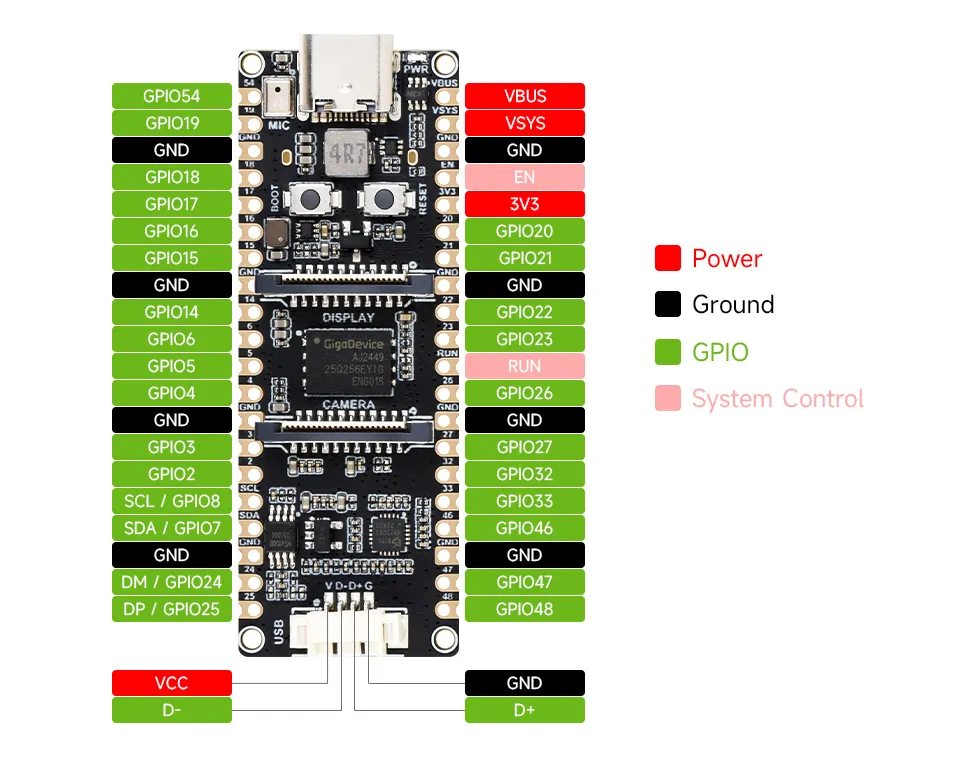

# PHP on ESP32-P4

This project takes PHP — yes, *that* PHP, the one from websites — and crams it inside a
microcontroller, where it has no business being.

It's a pure academic experiment: it's useless. It doesn't solve a problem, it doesn't save
time, it doesn't make money. If anything: the very same thing, with a real microprocessor
(a SoC running Linux, pocket change), you'd do in an afternoon, with half the effort and a
tenth of the headaches. I know that perfectly well. I'm doing it anyway, because the only
question it answers is: *"can it be done?"*. Apparently yes.

The goal is to actually run PHP on a microcontroller. Not simulate it, not transpile it,
not fake it with a toy interpreter: take any `index.php` and run it on the chip, opcode by
opcode. You hand it a file, it runs it, like a real interpreter. It loads from a microSD:
you pull the card, write the file from your PC, put it back, press reset, and the board runs
the new script. No recompiling.

## It's real PHP, not a workaround

Let me get this out of the way first, because it's the part that matters: there's no
rewritten PHP interpreter here, no "PHP-like" subset, no transpiler or translator to another
language. It's the official PHP engine running inside the ESP32, the exact same C code that
runs on a server.

The source is the release from [php.net](https://www.php.net/) (`php-8.3.32`, sha256
verified), untouched: it lives in `components/php/php-8.3.32/` exactly as it comes out of the
tarball, and every necessary adjustment is a separate patch, never an edit to the source. I
compile the full Zend Engine into it: the lexer, the parser, the opcode compiler, the
virtual machine and the executor, the garbage collector, the memory manager, the object,
class and exception system. When you write `<?php echo 1+1;`, that code goes through the same
pipeline it would on a PC — source, tokens, syntax tree, opcodes, execution — with no
shortcuts.

And it runs as native machine code, not as emulation: PHP's C is compiled with the
`riscv32-esp-elf` cross-compiler and the opcodes are executed by the board's RISC-V CPU.
There's no hidden PC, no x86 emulator, no second processor doing the work. The hook into the
engine is the `embed` SAPI (`php_embed`), the official interface for embedding PHP into C
applications: not a trick.

The real standard library is here too: `ext/standard` (string, array, math, var_dump...),
PCRE (real regexes), JSON, hash, SPL, reflection, random. `array_map`, `preg_match`,
`json_encode`, `sha1` are all there, and they do exactly what they do elsewhere because
they're the same code. What you'd do with them on a microcontroller remains a mystery to me
too.

In practice, the binary that ends up in flash contains PHP. If you take the same `index.php`
and give it to this engine or to a command-line `php`, you get the same result, because
underneath it's the same interpreter.

## How to use it

A script can be linear — it runs from start to finish — or follow the Arduino-style
`setup()`/`loop()` model: `setup()` runs once, `loop($tick)` is called over and over. The
real loop lives in C, which gives it a place for memory housekeeping and for not getting
reset by the watchdog; PHP provides the two functions.

```php
<?php
// index.php on the microSD: blinks an LED forever.
// LED + resistor (~330 ohm) between GPIO2 and GND.

define('LED', 2);

function setup(): void {
    gpio_mode(LED, GPIO_OUTPUT);
    echo "PHP " . PHP_VERSION . " on ESP32-P4\n";
}

function loop(int $tick): void {
    gpio_write(LED, $tick % 2);   // on for odd ticks, off for even
    delay(500);                    // half a second
}
```

`gpio_mode`, `gpio_write`, `gpio_read` and `delay` come from a small purpose-built extension
(`components/php_ext_gpio/`). `delay()` isn't a busy-wait: it yields the core via
`vTaskDelay`, so the watchdog stays happy. `echo` comes out on a serial port.

Here's that sketch running on the board — three lines of PHP driving a physical pin:


There are more ready-made sketches in [`examples/`](examples/), one per folder.

## Hardware

| | |
|---|---|
| Board | Waveshare **ESP32-P4-Pico** (Raspberry Pi Pico form factor) |
| SoC | ESP32-P4, 32-bit dual-core RISC-V, up to 400 MHz |
| RAM | 32 MB in-package PSRAM, plus 768 KB internal |
| Flash | 32 MB NOR |
| Storage | microSD (SDIO) |
| USB | OTG 2.0 HS |

No WiFi or Ethernet on this variant: no networking at all. Yes: PHP, the language born for
the web, on a board that doesn't even know what a network is. The irony isn't lost on me.

The GPIOs exposed on the header:



## How it works inside

The ESP32-P4 has four places where code and data live, each with a specific role. Code isn't
copied into RAM: it runs straight from flash through the MMU cache (execute-in-place).
Internal RAM is small and fast; PSRAM is large and holds the runtime heap, where PHP
allocates zvals, HashTables, compiled opcodes and objects.

The engine's static footprint is surprisingly modest: about 97 KB of uninitialized data (the
largest structures are the `crypt` tables), comfortable within the 768 KB of internal RAM.
The task stack is large (64 KB) because PHP's compiler recurses heavily and `zend_bailout`
uses `setjmp`/`longjmp`.

When you run `<?php echo 1+1;`, the text goes into `zend_compile_string()`, which tokenizes
it, turns it into a syntax tree and then into opcodes; `zend_execute()` runs the virtual
machine, a loop that takes one opcode at a time and calls the C function that implements it
(`ZEND_ADD`, `ZEND_ECHO`...); `ZEND_ECHO` ends up in the SAPI's output funnel and from there
on the serial port. It's exactly a server's path, just on a single RISC-V core at 360 MHz.

The memory-map and execution-flow diagrams are in [docs/architecture.md](docs/architecture.md).

## How it's built

PHP's build system isn't used: no `./configure`. `configure` runs test programs that can't
run on the target, and some steps invoke the just-compiled binary, which here is a RISC-V
executable and dies on the PC. In its place there's an ESP-IDF component with a hand-written
`CMakeLists.txt` and `php_config.h`. Everything is static: no `dl()`, no shared extensions.
The entry point is the `embed` SAPI.

```
php-esp32/
├── php-esp32.toml            repo descriptor: default PHP version + board
├── setup.sh · flash.sh · monitor.sh    install · build+flash · serial monitor
├── scripts/
│   ├── fetch-php.sh          downloads, verifies and patches the PHP source
│   ├── fetch-sqlite.sh · fetch-oniguruma.sh   optional-extension sources, on demand
│   ├── check-manifest.py     keeps the manifests in sync with the build
│   └── info.sh               what this checkout can build (versions, boards, modes)
├── CMakeLists.txt            generic: selects the board and PHP version
├── cmake/resolve-board.cmake board resolution (shared by the top-level and main)
├── sdkconfig.defaults        base config (board-agnostic: task stack, FAT long names)
├── boards/                   one directory per chip family, then per board
│   └── esp32-p4/             family: target + PSRAM (sdkconfig.family, family.toml)
│       └── esp32-p4-pico/    board: pins + mount code (board.c/.h), sdkconfig.board,
│                             partitions.csv, board.toml (its capabilities)
├── main/main.c               boot: mounts storage via the board, starts the engine
├── components/
│   ├── php/
│   │   ├── CMakeLists.txt     generic: builds the selected PHP version
│   │   ├── compat/            shared POSIX stubs (posix_stubs, syslog, ...)
│   │   ├── versions/8.3.32/   per-version: sources.cmake, config headers, patches,
│   │   │                      manifest.toml, version-sensitive compat
│   │   └── php-8.3.32/        PHP source (not committed)
│   └── php_ext_gpio/          the gpio_*/delay extension
├── examples/                  example sketches (one per folder)
├── docs/                      architecture, porting notes, footprint, extensions
└── resources/                 board datasheets and pinout
```

Two knobs pick what gets built: `-DPHP_VERSION=<ver>` and `-DBOARD=<board>` (defaults in
`php-esp32.toml`). Everything version-specific lives under `components/php/versions/<ver>/` and
everything board/family-specific under `boards/<family>/<board>/`, so adding a PHP version or a
board is a new directory, not edits across the tree — see
[`components/php/versions/README.md`](components/php/versions/README.md) and
[`boards/README.md`](boards/README.md). `./scripts/info.sh` prints what's available.

The PHP source isn't committed (it's ~210 MB, reproducible from the official tarball):
`scripts/fetch-php.sh` downloads it, checks its sha256 and applies the local patches.

The bulk of the work wasn't "compiling PHP" but convincing an engine full of
operating-system dependencies that it's at home on a chip that has no operating system: the
hand-corrected `php_config.h`, the portable virtual machine, the stubs for the missing POSIX
symbols, and a handful of surprises that only showed up with the chip in hand. The full
story, with every choice and its reason, is in [docs/porting-notes.md](docs/porting-notes.md).

## Trade-offs

Running PHP on a chip with no operating system means constantly choosing between "how it
should be" and "how it actually holds up". The main choices.

**How the script arrives.** In theory I could bake the PHP code straight into the firmware,
but changing one line would mean recompiling and rewriting the flash every time:
inconvenient, and far from the idea of an interpreter. I picked a board with a microSD slot
and read `index.php` from there. (Why the Waveshare ESP32-P4-Pico in particular and not
another? Rigorous engineering rationale: I had it lying around.)

**The memory manager.** Zend's memory manager thinks in 2 MB blocks, tuned for a server. On a
chip. I gave it a pat on the shoulder and switched to the system `malloc`, which draws from
PSRAM. Less refined, but solid.

**The virtual machine.** PHP's fast VM uses computed-gotos and global registers, which don't
compile on this target. I use the portable "call" variant: a touch slower, but it works
everywhere.

**What I left out.** `ext/date` (the `DateTime` class and the date/time functions) is off by
default — a minimal UTC stub covers the few core call sites — but it builds in as an optional
extension for about 650 KB when you want it. Networking and processes don't exist on this
hardware. And `Fiber`s: they'd need context-switch assembly for 32-bit RISC-V that doesn't
exist, so here they're more a philosophical concept than a feature. These are choices, not
limits of the language: classes, closures, generators, exceptions, traits, namespaces and
types are all there.

The "USB stick" variant too (exposing the microSD as a mass-storage drive) was left out. On
this board the USB-C is a serial bridge, not the chip's native USB, so it would mean two
separate connections and a lot of complexity for a convenience the microSD round-trip already
covers. On a board where the USB-C is the native USB it would be clean: it stays there as a
possible extension.

## Which ESP32s would work

The deciding factor isn't the core architecture. PHP is portable C and I use the "call" VM
(no architecture-specific assembly), so it compiles on both Xtensa and RISC-V. What matters is
writable runtime RAM: the engine allocates megabytes of heap, and two things are needed. The
first is external PSRAM: the heap doesn't fit in the few hundred KB of internal SRAM. The
second is roomy flash, 8 MB or more, because the image is about 3 MB. Core speed only changes
*how* usable it is, not *whether* it works.

| Chip | Core | PSRAM | Works? | Why |
|---|---|---|---|---|
| ESP32-P4 | RISC-V, 2 cores, 400 MHz | up to 32 MB | yes (it's the target) | plenty of PSRAM, big flash, fast |
| ESP32-S3 | Xtensa, 2 cores, 240 MHz | up to 8-16 MB | yes | has PSRAM and flash; needs recompiling for Xtensa, but the code is the same. The most accessible way to reproduce it |
| ESP32 (WROVER) | Xtensa, 2 cores, 240 MHz | 4-8 MB | in theory | needs a WROVER module with PSRAM; the classic one maps only 4 MB at a time, so the heap is tighter. Untested |
| ESP32-S2 (WROVER) | Xtensa, 1 core, 240 MHz | ~2 MB | borderline | only with a PSRAM-equipped module; 2 MB is little. Single-core isn't a problem |
| ESP32-C3 / C6 / C2 | RISC-V, 1 core | none | no | no PSRAM, a few hundred KB of SRAM: the heap doesn't fit |
| ESP32-H2 / H4 | RISC-V, 1 core, ~96 MHz | none | no | low-power 802.15.4 chips: little RAM, no PSRAM, slow |
| ESP8266 | Xtensa, 1 core, 80 MHz | none | no | ~80 KB of RAM: out of the question |

In one line: you need an ESP32 with PSRAM (P4 and S3 leading). The whole C and H series, with
no PSRAM, is ruled out regardless of speed. If your board has no PSRAM, PHP waves at you
fondly and doesn't start.

## Build and flash

Tested on Fedora, but any system supported by
[ESP-IDF](https://docs.espressif.com/projects/esp-idf/) is fine. You need a few GB of disk and
a board connected over USB-C.

Two scripts do everything:

```bash
./setup.sh    # prerequisites + ESP-IDF (toolchain) + PHP source
./flash.sh      # builds, asks for the port, flashes, then offers the monitor
```

`setup.sh` is run once. `flash.sh` lists the serial ports, lets you pick the right one,
unlocks permissions if needed, and at the end asks whether to open the monitor. The board has
an onboard USB-UART bridge (CH343P) on the USB-C port, wired to the chip's UART0: a single
cable does power, flashing and console, with automatic reset.

By hand, without the scripts:

```bash
./scripts/fetch-php.sh                    # once: gets the PHP source
source ~/esp/esp-idf/export.sh            # in every shell
idf.py set-target esp32p4                 # first time only
idf.py build
idf.py -p /dev/ttyACM0 flash monitor
```

The details, port selection and troubleshooting are in [docs/flash.md](docs/flash.md).

To change what runs on the board there's no rebuild: pull out the microSD, rewrite
`index.php` from your PC, put it back, press reset.

## Status

The engine compiles and links with no unresolved symbols, boots on the board (registers a few
hundred functions and a few dozen classes), runs code — from a `zend_eval_string("echo
1+1;")` that prints `2` up to a full `index.php` read from the microSD, with string, array,
`json_encode`, `sha1`. The GPIO extension and the `setup()`/`loop()` model are up: a blink
sketch turns an LED on from three lines of PHP and keeps running, with the output on serial.
Composer autoloading works too, with a real `vendor/` tree loaded from the card.

## References

In the [`resources/`](resources/) folder: datasheets and technical manual for the ESP32-P4,
plus datasheet, pinout and dimensions of the Waveshare ESP32-P4-Pico board.

More depth in [`docs/`](docs/): the [architecture](docs/architecture.md) with the diagrams,
the [porting notes](docs/porting-notes.md) with all the technical choices, the
[footprint](docs/footprint.md) (flash and RAM, per area and per extension), the
[extension status](docs/ext-porting.md) (every PHP extension: built-in, flag, or not ported),
and the [flashing guide](docs/flash.md).

## License

MIT — see [LICENSE](LICENSE). This covers the project's own code; the PHP source it builds
on (fetched separately, not committed) stays under the [PHP License](https://www.php.net/license/).
