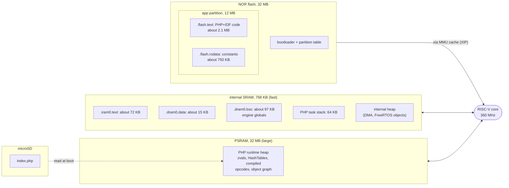
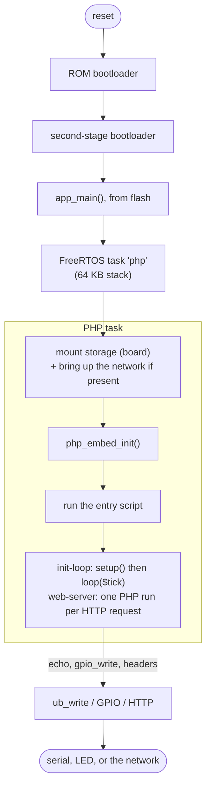

# Architecture: memory and execution

Where data lives, and what happens when the engine runs PHP. The diagrams use the ESP32-P4 as the
worked example; a note at the end covers how the ESP32-S3 differs. The numbers are from the current
build.

## Memory map

The chip has four places where code and data live, each with a role. The important one to internalize:
code is not copied into RAM. It runs straight from flash through the MMU cache (execute in place),
which is why a few hundred KB of internal SRAM is enough for a 3 MB image. Internal SRAM is small and
fast; PSRAM is large and holds the runtime heap.

The static footprint is modest. About 97 KB of uninitialized data (the largest structures are the
`crypt` tables) plus a handful of KB of initialized data, well inside the internal SRAM. Everything
that grows at runtime lives in PSRAM instead.

PSRAM is where PHP allocates. Zend's own memory manager is set aside (`USE_ZEND_ALLOC=0`) so the
engine calls `malloc`, and the ESP-IDF configuration routes those allocations into PSRAM: the function
and class tables, the zvals, the compiled opcodes and the object graph the script builds all end up
there. Keeping PHP out of internal SRAM is not an optimization, it is a requirement: the internal RAM
has to stay free for DMA and FreeRTOS objects, which cannot live in PSRAM.

The PHP task stack is large (64 KB) because the compiler recurses heavily and `zend_bailout` unwinds
with `setjmp`/`longjmp`.

## Execution flow

From reset to output. The first steps are the ordinary ESP-IDF boot; the rest is the pipeline PHP
runs everywhere.

Concretely, take `<?php echo 1 + 1;`. The source goes into `zend_compile_string()`, which tokenizes
it, builds a syntax tree, and lowers it to opcodes, the instructions of PHP's virtual machine. The
opcodes live in the PSRAM heap. `zend_execute()` then runs the VM: a loop that takes one opcode at a
time and calls the C function that implements it (`ZEND_ADD`, `ZEND_ECHO`, and the rest). This build
uses the portable "call" variant of the VM rather than the computed-goto variant, which does not
compile on these targets. `ZEND_ECHO` reaches the SAPI's output funnel (`ub_write`), and from there
the bytes go to the serial console, or, under the web-server model, into the HTTP response.

It is exactly the path the code takes on a server. Here it runs on a single core at a few hundred MHz
instead of a PC.

## The two execution models

**init-loop.** The entry script may be linear, or it may define `setup()` and `loop()`. In the second
case the file is run once (which defines the functions), then C calls `setup()` once and `loop($tick)`
repeatedly. The loop lives in C on purpose: that is where the cycle collector
(`gc_collect_cycles()`) runs periodically, and where the calls into PHP are wrapped in
`zend_try`/`zend_catch`, so a fatal error in the script is caught instead of resetting the board.
`delay()` inside `loop()` yields the core through `vTaskDelay`, keeping the watchdog satisfied.

**web-server.** `php_embed_init()` opens one request, so the firmware closes it and then cycles
`php_request_startup()`, run the entry script, `php_request_shutdown()` for each HTTP request. Because
each request is shared-nothing, re-running the top-level script every time does not trip
redeclaration errors. Output is captured by pointing the live SAPI `ub_write` at a response buffer,
`$_SERVER` is materialized and filled per request, and static files under `public/` are served
directly without entering PHP. The engine itself stays up across requests; only the request state is
torn down and rebuilt. Full detail is in [porting-notes.md](porting-notes.md).

## How the ESP32-S3 differs

The shape is the same; the sizes and a few peripherals change. The S3 is dual-core Xtensa LX7 rather
than RISC-V, so PHP is built with the `xtensa-esp32s3-elf` toolchain, but the portable VM means no
engine code changes. It carries 8 MB of PSRAM instead of up to 32 MB, and 16 MB of flash instead of
32 MB, so the same firmware and heap fit with less headroom: plain applications and a live web server
run comfortably, a full framework's container-compile step does not. Storage is a microSD over SPI
rather than the P4's 4-bit SDIO, and the wired network on the S3-ETH is a W5500 Ethernet controller on
SPI rather than an internal MAC with an RMII PHY. All of that is contained in the board's `board.c`;
`main.c` and the engine do not know the difference.
