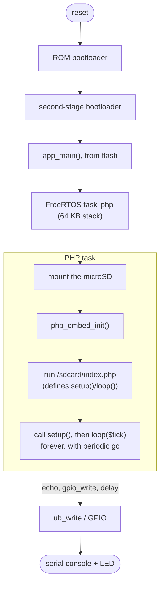

# Architecture: memory and execution

Where data lives in memory, and what happens when the engine runs PHP code. The numbers
are from the current build.

## Memory map

The ESP32-P4 has four places where code and data live, each with a specific role. One
important thing: code is not copied into RAM, it runs straight from flash through the MMU
cache (execute-in-place). Internal RAM is small and fast; PSRAM is large and holds the
runtime heap.

Key points.

Code runs from flash, not from RAM. The ~3 MB binary doesn't take up SRAM: the CPU reads
it from flash through the cache. That's why the small internal SRAM is enough.

The engine's static footprint is modest: about 97 KB of uninitialized data (the largest
structures are the `crypt` tables) plus a handful of KB of data, comfortable within the
768 KB of internal RAM.

PSRAM is where PHP allocates at runtime. With Zend's memory manager set aside
(`USE_ZEND_ALLOC=0`) the engine uses `malloc`, and the ESP-IDF configuration routes every
allocation into PSRAM: that's where the HashTables (function and class tables), the zvals,
the compiled opcodes and the objects the script creates all end up. Keeping PHP out of
internal RAM is essential: it leaves the internal RAM free for DMA and FreeRTOS objects.

The PHP task stack is large (64 KB) because PHP's compiler recurses heavily and
`zend_bailout` uses `setjmp`/`longjmp`.

## Execution flow

From reset to output. The first lines are the standard ESP-IDF boot; the rest is the same
pipeline PHP uses everywhere.

Concretely, here's what happens when you run `<?php echo 1+1;`.

The source text goes into `zend_compile_string()`: it's tokenized, turned into a syntax
tree (AST) and then into opcodes, the instructions of PHP's virtual machine. The opcodes
live in the PSRAM heap.

`zend_execute()` runs the VM: a loop that takes one opcode at a time and calls the C
function that implements it (`ZEND_ADD`, `ZEND_ECHO`, ...). We use the "call" variant of
the VM, the portable one, instead of the computed-goto variant (which doesn't compile on
RISC-V).

`ZEND_ECHO` ends up in the SAPI's output funnel (`ub_write`), which writes to the serial
console.

It's exactly the path the code takes on a server: here it just runs on a single RISC-V
core at 360 MHz instead of a PC CPU.

## The setup/loop cycle

A script can be linear, or it can define `setup()` and `loop()`. In the second case the
file is run once (which defines the two functions), then the C side calls `setup()` once
and `loop($tick)` over and over. The loop lives in C on purpose: that's where the cycle
garbage collector (`gc_collect_cycles()`) is run periodically, and the calls into PHP are
wrapped in `zend_try`/`zend_catch`, so a fatal error in the script is caught instead of
taking the board down. `delay()`, inside `loop()`, yields the core via `vTaskDelay`,
keeping the watchdog happy.
