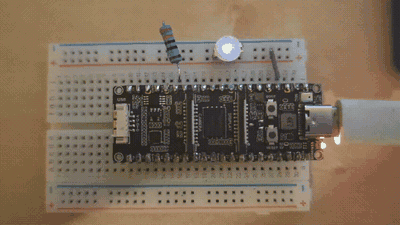

# blink-sos

The LED spells "SOS" in Morse code, over and over. It builds on led-blink: instead of a
plain on/off toggle, PHP now runs real logic on each pass of the loop to shape the timing
of the blinks.



## What it does

`index.php` uses the same `setup()`/`loop()` model. `setup()` makes GPIO2 an output;
`loop()` walks the Morse pattern for S O S (three dots, three dashes, three dots) and
pulses the LED for each symbol. A dot is one time unit, a dash is three, with a one-unit
gap between symbols and a longer gap before the sequence repeats.

```php
define('LED', 2);
const UNIT = 200;   // milliseconds; a dot is one unit, a dash is three

function pulse(int $units): void {
    gpio_write(LED, 1);
    delay(UNIT * $units);
    gpio_write(LED, 0);
    delay(UNIT);            // gap between symbols
}

function loop(int $tick): void {
    foreach ([1, 1, 1, 3, 3, 3, 1, 1, 1] as $units) {   // S O S
        pulse($units);
    }
    delay(UNIT * 6);        // longer gap before repeating
}
```

## What it demonstrates

- **The language does real work between blinks.** A helper function, a `foreach` over an
  array, arithmetic on a constant: this is ordinary PHP structuring the output, not a
  hard-coded sequence. The engine compiles and runs it on the chip like any other script.
- **Timing is under PHP's control.** The dot/dash/gap durations all come from `UNIT` and
  the pattern array, so the shape of the signal is decided in PHP, not in C.
- **It keeps running.** The pattern repeats from `loop()` indefinitely, with the free heap
  holding steady tick after tick.

## The output

Excerpt from [`monitor.txt`](monitor.txt) (the full serial log):

```
PHP 8.3.32 on ESP32-P4
--- /sdcard/index.php ---
blinking SOS on GPIO 2
php-esp32: entering loop()
php-esp32: tick 0 -- heap free: 32724919 bytes
```

## Building and running

```sh
phpflash build && phpflash flash && phpflash monitor
```

To run from a microSD instead, copy `project-src/index.php` to the card root and press
reset.

Wiring: an LED with a series resistor between GPIO2 and GND. The GPIO drives **3.3V**,
not 5V, so a red LED with ~330 ohm is clearly visible; a blue or white LED (higher
forward voltage) can be too dim to see at 3.3V.
