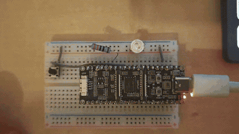

# button-led

A push button turns the LED on and off. Where led-blink and blink-sos only drive an
output, this example also reads an input: PHP polls a button and mirrors its state to the
LED.



## What it does

`setup()` makes GPIO2 an output and GPIO4 an input. `loop()` reads the button every 20 ms
and lights the LED while it is held down. The button wires GPIO4 to ground; resetting the
pin leaves its internal pull-up on, so the input reads 1 when idle and drops to 0 when the
button is pressed.

```php
define('LED', 2);
define('BUTTON', 4);

function setup(): void {
    gpio_mode(LED, GPIO_OUTPUT);
    gpio_mode(BUTTON, GPIO_INPUT);
}

function loop(int $tick): void {
    $pressed = gpio_read(BUTTON) === 0;   // pulled low when pressed
    gpio_write(LED, $pressed ? 1 : 0);
    delay(20);
}
```

## What it demonstrates

- **PHP reads the hardware, not just writes it.** `gpio_read` brings a physical pin's
  state back into the script; the LED reacts to a real button in the world.
- **It's a genuine input/output loop.** Read a pin, decide, drive another pin, repeat.
  This is the shape of most microcontroller programs, expressed entirely in PHP.
- **It stays responsive and steady.** Polling every 20 ms feels instant, and the free heap
  is flat across thousands of ticks in the log.

## The output

Excerpt from [`monitor.txt`](monitor.txt) (the full serial log):

```
PHP 8.3.32 on ESP32-P4
--- /sdcard/index.php ---
mirroring the button (GPIO 4) to the LED (GPIO 2)
php-esp32: entering loop()
php-esp32: tick 0 -- heap free: 32725547 bytes
php-esp32: tick 256 -- heap free: 32725547 bytes
php-esp32: tick 512 -- heap free: 32725547 bytes
```

## Building and running

```sh
phpflash build && phpflash flash && phpflash monitor
```

To run from a microSD instead, copy `project-src/index.php` to the card root and press
reset.

Wiring: an LED with a series resistor (~330 ohm) between GPIO2 and GND, and a push button
between GPIO4 and GND. No external resistor is needed on the button: the pin's internal
pull-up holds it high until the button pulls it to ground. The GPIO drives **3.3V**, not
5V, so a red LED is the safe choice; a blue or white LED can be too dim to see at 3.3V.
