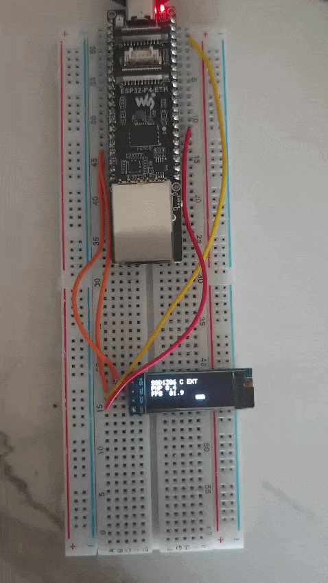

# oled-ssd1306-ext

The same 0.91" SSD1306 128x32 OLED as [`oled-ssd1306-fps`](../oled-ssd1306-fps/), but driven by a
**native C extension** instead of a pure-PHP bit-banged driver. It is the second half of the pair:
run both and compare the frame rate.

The driver -- the I2C link (the ESP32 hardware I2C peripheral), the framebuffer and the text
rendering -- lives in C, in `firmware/exts/ssd1306/`. PHP just calls the `ssd1306_*` functions. This
is a **per-project extension**: phpflash compiles everything under a project's `firmware/exts/` into
the firmware, and the firmware registers it at startup. Nothing about the base firmware changes.



## Result

Full 128x32 frames of 512 bytes each, on the ESP32-P4-ETH (PHP 8.4, 360 MHz):

| Driver | FPS | Bound by |
|---|---|---|
| Pure PHP, bit-banged I2C ([`oled-ssd1306-fps`](../oled-ssd1306-fps/)) | ~41 | the PHP interpreter (per-edge call overhead) |
| **Native C, hardware I2C** (this example) | **~82** | the I2C bus (400 kHz fast mode) |

The C driver is exactly **2x** faster and now runs into the I2C bus limit rather than the CPU: at
400 kHz, 512 bytes plus the addressing take about 12 ms, so ~82 full frames a second is close to the
theoretical ceiling for this panel. The pure-PHP version never gets near it -- the interpreter caps
the effective clock long before the bus does.

## The extension

A project adds custom C extensions by dropping them under `./firmware/exts/`:

```
oled-ssd1306-ext/
├── php-esp32.config.toml
├── project-src/
│   └── index.php               # the demo, calling ssd1306_*
└── firmware/exts/
    └── ssd1306/
        └── ssd1306.c           # defines zend_module_entry ssd1306_module_entry
```

Each subdirectory of `firmware/exts/` is one extension. Its `*.c` are compiled in, and it must define
`zend_module_entry <dirname>_module_entry` (here `ssd1306_module_entry`) -- the same shape as the
built-in `gpio` extension. phpflash passes the directory to the build, the firmware compiles the
sources, and registers each module after `php_embed_init()` so its functions are available to the
script. An extension that needs extra ESP-IDF components lists them in
`firmware/exts/<name>/idf_requires.txt` (one per line); this one needs none beyond the common set.

See [docs/extensions/custom-extensions.md](../../docs/extensions/custom-extensions.md) for the full contract.

## Functions

```
ssd1306_begin(int $sda, int $scl, int $addr = 0x3C): bool   // bring up I2C + init the panel
ssd1306_present(): bool                                      // does the panel ACK?
ssd1306_clear(): void
ssd1306_pixel(int $x, int $y): void
ssd1306_rect(int $x, int $y, int $w, int $h): void
ssd1306_text(int $x, int $y, string $s): void               // 5x7 font
ssd1306_flush(): bool                                        // push the framebuffer
```

## Wiring

| OLED | Board (ESP32-P4-ETH) |
|---|---|
| VCC | 3V3 |
| GND | GND |
| SDA | GPIO7 (board pin "SDA / GPIO7") |
| SCL | GPIO8 (board pin "SCL / GPIO8") |

## Run it

```sh
phpflash build      # compiles firmware/exts/ssd1306 into the image
phpflash flash
phpflash monitor
```

Nothing here needs the microSD or the network: storage is `embedded`, so the script is baked into the
flash image and runs straight from reset.
