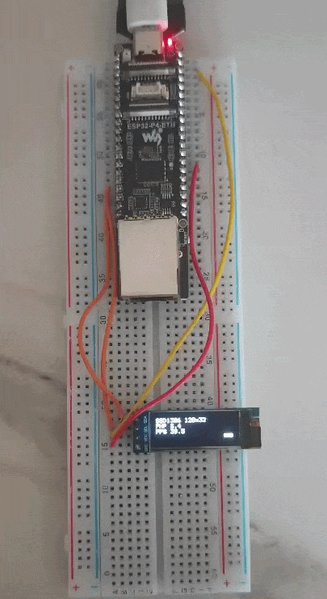

# oled-ssd1306-fps

A 0.91" SSD1306 OLED (128x32, I2C) driven entirely from PHP, as a frame-rate
benchmark. The I2C link is bit-banged in PHP over two GPIO pins -- there is no
C-side I2C driver. Every START, clock edge and byte is a PHP call, so the number
on screen is how fast the language alone can push full frames to the panel.

The companion [`oled-ssd1306-ext`](../oled-ssd1306-ext/) drives the same panel through a
native C extension instead; at ~82 FPS it is twice as fast, so the pair shows what the
interpreter costs here.



## Wiring

| OLED | Board (ESP32-P4-ETH) |
|---|---|
| VCC | 3V3 |
| GND | GND |
| SDA | GPIO7 (board pin "SDA / GPIO7") |
| SCL | GPIO8 (board pin "SCL / GPIO8") |

The ESP32-P4-ETH breaks out a labelled I2C header (`SDA / GPIO7`, `SCL / GPIO8`); this
example uses it. The 0.91" modules carry their own SDA/SCL pull-ups, so the bus idles
high. Change `SDA` / `SCL` at the top of `project-src/index.php`, or the address passed to
`new SSD1306(...)`, for other pins or a panel that answers at `0x3D`.

## Files

- **`project-src/SSD1306.php`** -- the reusable driver: an `SSD1306` class with the I2C
  bit-bang, the panel init, the framebuffer and a small 5x7 text font. Drop it into another
  project and `require` it.
- **`project-src/index.php`** -- the demo: it `require`s the driver, wires the panel up in
  `setup()`, and benchmarks full-frame flushes in `loop()`.

## How the driver works

- **SCL** is a permanent push-pull output; the SSD1306 never stretches the clock.
- For the eight data bits **SDA** is driven push-pull. On the ninth (ACK) clock the
  master drives SDA low as well instead of releasing it -- a write-only master that
  ignores the ACK. That keeps SDA an output for the whole transfer and avoids a slow
  pin-direction change on every byte, which matters when the whole thing is
  interpreted PHP.
- `SSD1306::present()` is the one exception: it releases SDA and reads a real ACK, to
  report whether the panel is actually on the bus.
- A frame is the full 512-byte framebuffer (128 x 32 / 8) sent in a single I2C data
  transaction.

## Run it

```sh
phpflash build      # ESP32-P4-ETH, PHP baked into the image (embedded storage)
phpflash flash
phpflash monitor
```

`setup()` probes the panel, shows a splash, then `loop()` renders and flushes frames
in a fixed time window and reports the rate. The measured FPS is printed on the
serial log every burst and drawn on the panel itself, next to a block that sweeps
left-right one step per frame so the refresh is visible.

## Measured

On the ESP32-P4-ETH (default PHP 8.4, 360 MHz), full 128x32 frames of 512 bytes each,
the pure-PHP driver holds around **41 FPS** -- roughly 13 frames every 320 ms, steady.
The cost here is the per-edge PHP call overhead, not the panel: the native-extension
version ([`oled-ssd1306-ext`](../oled-ssd1306-ext/)) hits ~82 FPS on the same hardware,
where the 400 kHz I2C bus becomes the limit instead of the interpreter.

Nothing here needs the microSD or the network: the storage type is `embedded`, so the
script is compiled into the flash image and runs straight from reset.
