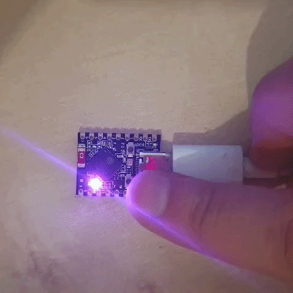

# s3-rgb-show

Drive the **onboard RGB LED** of an ESP32-S3 board from PHP: a slow, **continuous rainbow**. The
brightness is deliberately low (`BRIGHT = 10` in `index.php`) — the WS2812 is dazzlingly bright,
especially on camera; raise it if you want it more vivid.



## What it needs

- An **ESP32-S3 board with the onboard WS2812 RGB LED** (soldered on most S3 dev boards). This is an
  S3-only feature: the P4 boards have no such LED.
- The **`s3_onboard_rgb` extension**, enabled in the config:

  ```toml
  [extensions.s3_onboard_rgb]
  enabled = true
  pin     = 48   # the LED's data pin -- set it to match your board
  ```

  The extension drives the WS2812 straight from the SoC's RMT peripheral (no external library). It is
  compiled in only for `esp32s3` targets; enabling it for a P4 board fails the build with a clear
  message.

## The API

- `s3_onboard_rgb_set(int $r, int $g, int $b)` — set the colour, each channel `0..255`.
- `s3_onboard_rgb_hsv(int $h, int $s, int $v)` — set by hue/saturation/value (`h` 0..359), handy for
  rainbows.
- `s3_onboard_rgb_off()` — turn it off.
- `s3_onboard_rgb_available(): bool` — whether the extension is built in.
- `S3_ONBOARD_RGB_PIN` — the data pin the firmware was built with.

## Build & flash

```
phpflash build
phpflash flash
phpflash monitor
```

The serial log prints one line per round; the LED does the rest.

## The pin

Different S3 boards wire the LED to different pins (commonly GPIO 48, but boards vary). Set
`[extensions.s3_onboard_rgb] pin` to the one your board uses. `phpflash discover` identifies the
board; check its documentation for the LED pin.
