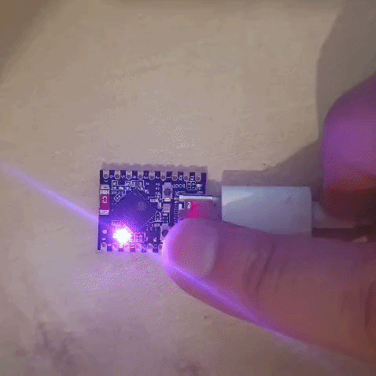

# s3-rgb-show

Drive the **onboard RGB LED** of an ESP32-S3 board from PHP: a slow, **continuous rainbow**. The
brightness is deliberately low (`BRIGHT = 10` in `index.php`) — the WS2812 is dazzlingly bright,
especially on camera; raise it if you want it more vivid.



## What it needs

- An **ESP32-S3 board with the onboard WS2812 RGB LED** (soldered on most S3 dev boards).
- The **`led` extension** with the `ws2812` driver, enabled in the config:

  ```toml
  [extensions.led]
  enabled = true
  leds    = ["ws2812"]
  ```

  The driver sits on ESP-IDF's `led_strip` (RMT). The pin and pixel count are passed when you make the
  object, not in the config.

## The API

A per-chip driver object under `Baremetal\Led\Driver`:

```php
use Baremetal\Led\Driver\Ws2812;

$led = new Ws2812(48, 1, Ws2812::RGB);  // pin 48, 1 pixel; onboard LED is RGB order (strips are GRB)
$led->hsv(0, $h, 255, 10);              // pixel 0 from hue/sat/val (h 0..359, s/v 0..255)
$led->show();                           // flush to the LED
```

- `pixel(int $i, int $r, int $g, int $b)` / `fill($r, $g, $b)` — write the buffer (each channel `0..255`).
- `hsv(int $i, int $h, int $s, int $v)` — set a pixel by hue/saturation/value.
- `set($r, $g, $b)` — fill + show, the convenient one-LED case.
- `show()` — send the buffer to the LED(s). `off()` — all off.
- `count(): int` — the number of pixels.

All drivers implement `Baremetal\Output\Led`, so code can accept any addressable LED.

## Build & flash

```
phpflash build
phpflash flash
phpflash monitor
```

The serial log prints one line at startup; the LED does the rest.

## The pin and byte order

Different S3 boards wire the LED to different pins (commonly GPIO 48, sometimes 38). Change `PIN` in
`index.php` to match; `phpflash discover` identifies the board. The onboard LED uses **RGB** byte order
(`Ws2812::RGB`); external WS2812 strips are usually **GRB** (the default, so you can omit the argument).
