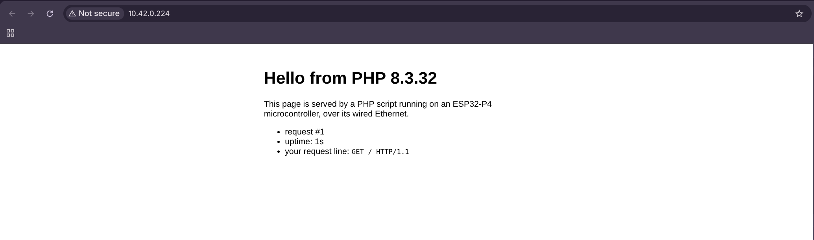

# web-server-init-loop

A web page served by PHP running on the microcontroller, over the board's wired Ethernet —
with **PHP itself owning the socket**, in the `setup()`/`loop()` model. `index.php` opens a TCP
server on port 80 and answers each HTTP request with a small page, all in plain PHP, straight on
the chip's lwIP stack.

> There are two web-server examples. This one keeps the whole server *in PHP* (init-loop model).
> The sibling [`web-server`](../web-server/) instead uses the firmware's **`web-server` project
> type**: a C HTTP server runs in front and PHP is invoked fresh per request, the way a script
> runs behind Apache. Same page, different execution model.

## Needs the ESP32-P4-ETH board

This example needs wired networking, so it targets `esp32-p4-eth` (the board with the on-board
Ethernet PHY). The firmware brings the link up at boot: boards that have a network initialise
Ethernet, run a DHCP client, and log the address on the serial console —

```
php-esp32: network up -- http://192.168.1.42/
```

Plug the board's **RJ45 into your network** (a router/switch with DHCP) and keep the USB-C cable
connected for power and console. Without a cable or lease the firmware just logs
`network: no IP` and still runs the script.

## What it does

It uses the `setup()`/`loop()` model. `setup()` opens the listening socket once; `loop()`
handles at most one request per tick and returns, so the runtime keeps doing its housekeeping
between connections instead of blocking forever in a `while` loop.

```php
function setup(): void {
    global $server;
    $server = stream_socket_server('tcp://0.0.0.0:80', $errno, $errstr);
}

function loop(int $tick): void {
    global $server;
    $conn = stream_socket_accept($server, 1);   // up to 1s, then hand back to the runtime
    if ($conn === false) return;                 // nothing this tick
    $req  = fread($conn, 2048);
    $html = "<h1>Hello from PHP " . PHP_VERSION . "</h1> ...";
    fwrite($conn, "HTTP/1.1 200 OK\r\n...\r\n\r\n" . $html);
    fclose($conn);
}
```

`stream_socket_server` / `stream_socket_accept` are core PHP (ext/standard), so nothing extra
is compiled in. Because `loop()` returns each tick, the runtime runs `gc_collect_cycles()` and
its heap check between connections, exactly like the LED examples.

## What it demonstrates

- **PHP does real network I/O on the chip.** The socket calls go through lwIP; a browser on the
  same network loads a page generated by PHP on the ESP32-P4.
- **The board owns the network.** Ethernet bring-up (the IP101 PHY, RMII, DHCP) lives in the
  board's `board.c` behind `board_network_up()`; `main.c` calls it for any board that declares
  `BOARD_HAS_NETWORK` and logs the address. A board without a network (the Pico) skips all of it.

## Building and running

```sh
phpflash build && phpflash flash && phpflash monitor
```

Watch the console for the `network up -- http://<ip>/` line, then open that address in a browser.
To run from a microSD instead, copy `project-src/index.php` to the card root (as `/index.php`)
and reset.

## The output

On the serial console (the full log is in [`monitor.txt`](monitor.txt)):

```
php-esp32: network up -- http://10.42.0.224/
PHP 8.3.32 on ESP32-P4
--- /sdcard/index.php ---
HTTP server listening on tcp://0.0.0.0:80
served #1: GET / HTTP/1.1
served #2: GET /favicon.ico HTTP/1.1
```

Each `served #N` line is the script echoing from inside `loop()`. In the browser, a page
reporting the PHP version, an uptime counter and your request line — the request counter climbs
across reloads, because here a single long-running PHP process owns the server:



## Notes on running a server here

- **One connection at a time.** The loop accepts, answers and closes each request before the
  next — plenty for a status page or a small control panel, but it doesn't handle concurrent
  clients. A browser fetching `/` and then `/favicon.ico` is two sequential requests.
- **No DNS.** The board has no resolver (`gethostbyname` is stubbed), so the server binds to a
  numeric address and you reach it by IP. Outbound requests to hostnames won't resolve.
- **Numeric bind only.** `SO_REUSEADDR` isn't available, but on a fresh boot binding `:80` is
  clean, so it isn't needed.
