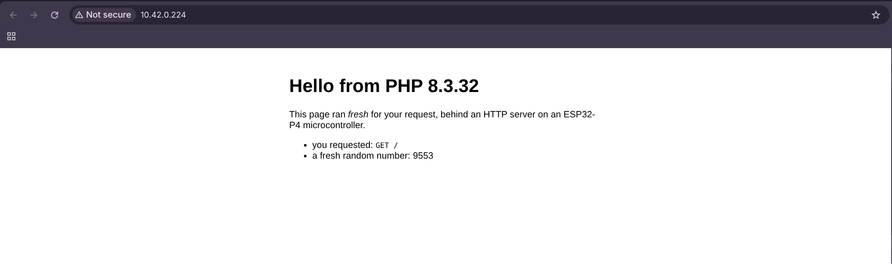

# web-server

A web page served by PHP on the microcontroller — using the firmware's **`web-server` project
type**. A C HTTP server (ESP-IDF's `esp_http_server`) runs in front, and your `index.php` is run
**fresh for every request**, the way a script runs behind Apache or PHP-FPM. You don't open a
socket or write a loop: you just produce the page, and whatever you `echo` becomes the response.

> There are two web-server examples. This one uses the firmware's web-server execution model
> (HTTP server in front, PHP per request — shared-nothing). The sibling
> [`web-server-init-loop`](../web-server-init-loop/) instead keeps the whole server *in PHP*, in
> the `setup()`/`loop()` model. Same page, different execution model.

## Needs the ESP32-P4-ETH board

It needs wired networking, so it targets `esp32-p4-eth`. The firmware brings the link up at boot,
runs a DHCP client, and logs the address on the serial console:

```
php-esp32: network up -- http://192.168.1.42/
php-esp32: web-server model: serving /sdcard/index.php over HTTP on :80
```

Plug the board's **RJ45 into your network** (DHCP) and keep USB-C connected for power and console.

## What it does

`index.php` is a plain, top-to-bottom script — no `setup()`/`loop()`, no socket handling:

```php
<?php
$uri = $_SERVER['REQUEST_URI'] ?? '/';
echo "<h1>Hello from PHP " . PHP_VERSION . "</h1>";
echo "<p>you requested: " . htmlspecialchars($uri) . "</p>";
echo "<p>fresh random number: " . random_int(1000, 9999) . "</p>";
```

The firmware runs it once per HTTP request. Because each request is a clean PHP run
(shared-nothing), there's no state to carry between them — the random number is there to show
each hit really executes again. The firmware builds a full CGI-style request environment before
running the script: `$_SERVER` (method, request-URI, query string, `Host`, headers, peer address),
`$_GET`, `$_POST` / `php://input`, and `$_COOKIE`; the status, headers and cookies the script sets
become the HTTP response.

## How it works

The `web-server` project type is a firmware execution model, selected at build time
(`-DPHP_PROJECT_WEB_SERVER=ON`, which `phpflash` passes when `type = "web-server"`). Instead of
the default run-script + `setup()`/`loop()` model, `main.c`:

1. brings the network up (via the board) and starts `esp_http_server` on port 80;
2. for a `GET`/`HEAD` of an existing file next to the entry script (a `public/` static asset —
   `robots.txt`, images, css/js), serves that file directly with a by-extension `Content-Type`, no
   PHP;
3. otherwise parses the request (method, URI, headers, cookies, body) into a CGI-style environment,
   runs one PHP request cycle (`php_request_startup()` → run `index.php` → `php_request_shutdown()`),
   and sends the status, headers and cookies the script set, with its output as the response body.

So the HTTP server, connection handling and request parsing are C (robust, one request at a
time by default), and only the page itself is PHP — exactly the split you get with a web server
in front of PHP on a normal host.

## Building and running

```sh
phpflash build && phpflash flash && phpflash monitor
```

Watch the console for `network up -- http://<ip>/`, then open that address in a browser and
reload a few times (the random number changes each time). To run from a microSD, copy
`project-src/index.php` to the card root (as `/index.php`) and reset.

## The output

On the serial console (the full log is in [`monitor.txt`](monitor.txt)):

```
php-esp32: microSD mounted at /sdcard
php-esp32: network up -- http://10.42.0.224/
php-esp32: web-server model: serving /sdcard/index.php over HTTP on :80
```

Per-request output is the HTTP response, not console text, so the console stays quiet after that.
In the browser, the page reports the PHP version, your request line and a fresh random number
that changes on every reload:



## Notes

- **One request at a time.** The server handles requests sequentially (PHP is single-threaded
  here); fine for a status page or a small control panel.
- **Shared-nothing.** Each request is a fresh PHP run, so nothing persists in PHP between
  requests — keep state on the microSD (e.g. via SQLite) if you need it.
- **No DNS.** The board has no resolver, so you reach it by IP.
