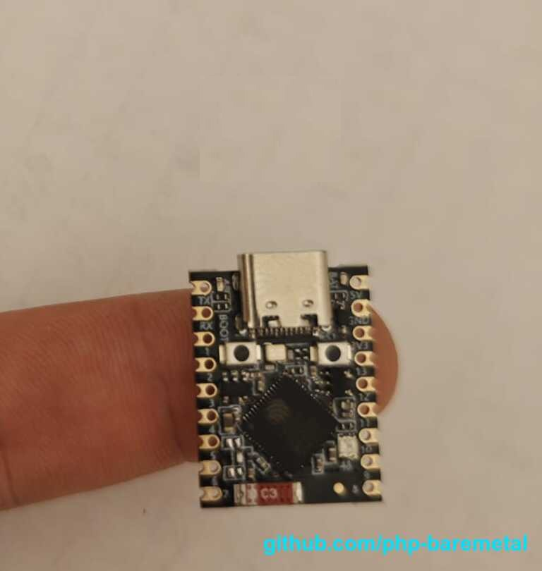
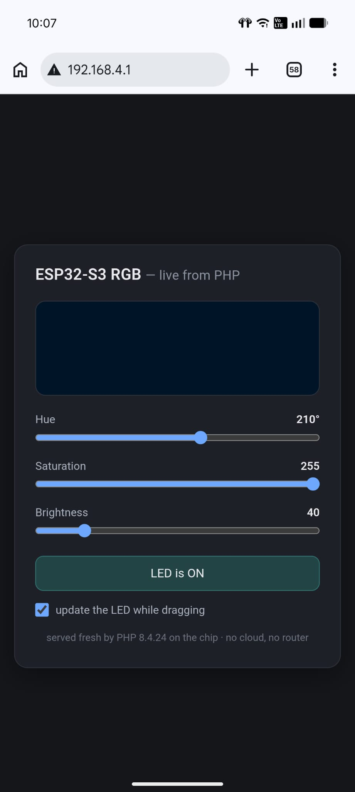

# wifi-ap-s3-rgb-manage

The board becomes a **standalone web app** that controls its own onboard RGB LED. On boot it creates
its own WiFi network and serves a control page from PHP; connect a phone, open the page, and drag the
sliders to change the LED's colour and brightness live. No router, no cloud, no wired network — the
whole thing runs on one ESP32-S3.

This is the full **web-server-over-WiFi** chain: three project pieces (the `web-server` model, the
`wifi` extension's SoftAP, and the `s3_onboard_rgb` LED extension) working together.

## See it in action

<p align="center">
  
</p>

<p align="center"><sub>The whole device: a fingertip-sized ESP32-S3 with an onboard RGB LED.</sub></p>

<p align="center">
  
</p>

That is a **real phone**, joined to the **board's own WiFi**, pointed at plain **`http://192.168.4.1/`** —
and **every pixel of that page was rendered by PHP running on the microcontroller**. No app to install, no
cloud, no server in a data centre. Drag the **Hue / Saturation / Brightness** sliders and each move flies
straight to the chip, which lights its onboard RGB LED and answers back — with the **"update the LED while
dragging"** checkbox you watch it change in real time as your finger moves. The footer says it plainly:
*served fresh by PHP 8.4.24 on the chip · no cloud, no router*. A **~$4**, fingertip-sized ESP32-S3 **is**
the whole stack at once: the network, the web server, the web page, and the hardware it controls.

## How it fits together

- **`type = "web-server"`** — an HTTP server runs in the firmware and invokes PHP fresh per request
  (shared-nothing, like PHP behind Apache).
- **`[web-server] init = "init.php"`** — a one-time *server_init* script that runs **before** the HTTP
  server binds. Here it calls `wifi_ap_start()` to bring up the access point, so the server then
  serves over WiFi. It also sets the LED's starting colour.
- **`index.php`** — the per-request front controller. `GET /` returns the control page;
  `GET /set?h=&s=&v=&on=` applies it to the LED and remembers it (a slider drag fires it as you move,
  or on release -- your choice, via the "update while dragging" checkbox).
- **State** lives in the in-RAM `mem_*` store (the WS2812 also physically holds its last colour), so
  the sliders open where the LED actually is — even though each request is a clean PHP run.

## The APIs it uses

- WiFi SoftAP: `wifi_ap_start($ssid, $password = null)`, `wifi_ap_ip()`, `wifi_available()`
- RGB LED: `s3_onboard_rgb_hsv($h, $s, $v)` (h 0-359, s/v 0-255), `s3_onboard_rgb_off()`,
  `s3_onboard_rgb_available()`
- In-RAM state: `mem_set()` / `mem_get()`

## Build & flash

```
phpflash build
phpflash flash
phpflash monitor
```

Set the network name/password at the top of `init.php` (default `php-rgb` / `baremetal`, WPA2).

## Use it

1. Flash, then connect your phone/laptop to the **`php-rgb`** WiFi network.
2. Open **http://192.168.4.1/** in a browser.
3. Drag Hue / Saturation / Brightness, or toggle the LED — the onboard RGB reacts instantly.

## Board support

Works on any **WiFi-capable ESP32-S3** board with the onboard WS2812 (S3-Zero, S3-Pico, S3-ETH…).
Every ESP32-S3 has WiFi on the die, so all S3 boards now offer the `web-server` model — the network
comes from the `wifi` extension rather than a wired link. Not for the radio-less ESP32-P4, and the
`s3_onboard_rgb` extension is S3-only.
