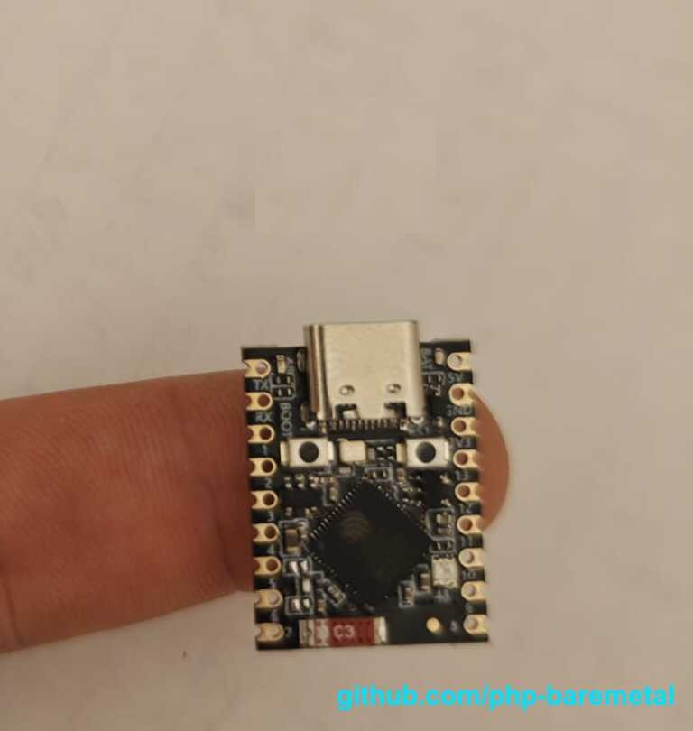
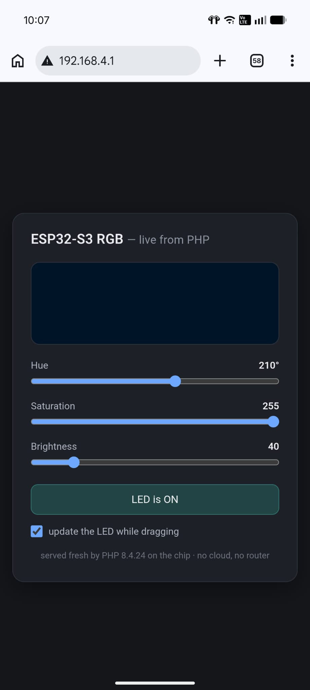

# wifi-ap-s3-rgb-manage

The board becomes a **standalone web app** that controls its own onboard RGB LED — **live over a
WebSocket**. On boot it creates its own WiFi network and serves a control page from PHP; connect a
phone, open the page, and drag the sliders to change the LED's colour and brightness in real time. Open
it on a second device and both stay in sync. No router, no cloud, no wired network — the whole thing runs
on one ESP32-S3.

This is the `event-driven` model with **two network sources on one resident reactor**: `http` serves the
page, `ws` carries the slider moves, and `ws_broadcast()` pushes each change back to every open browser.

## See it in action

<p align="center">
  
</p>

<p align="center"><sub>The whole device: a fingertip-sized ESP32-S3 with an onboard RGB LED.</sub></p>

<p align="center">
  
</p>

A **real phone**, joined to the **board's own WiFi**, pointed at plain **`http://192.168.4.1/`** — and
**every pixel of that page was rendered by PHP running on the microcontroller**. Each slider move flies to
the chip over a WebSocket, which lights its onboard RGB LED and broadcasts the new colour back, so the page
tracks the LED (and any other viewer) in real time. A **~$4**, fingertip-sized ESP32-S3 **is** the whole
stack at once: the network, the web server, the WebSocket, the page, and the hardware it controls.

## How it fits together

- **`type = "event-driven"`** — the script runs **once** to set things up, then a resident reactor on
  core 0 handles events. Because the engine stays up, the LED state is just a PHP variable that persists
  between events — no per-request store needed.
- **`init.php` (the entry, runs once)** — calls `wifi_ap_start()` to bring up the access point, registers
  the two listeners, sets the LED's starting colour, then starts the server with `serve_ws('/ws')` +
  `serve_http(80)`.
- **`index.php` (view controller)** — `init.php` renders it for `GET /`, with the current colour in scope;
  it hands that colour to the template.
- **`page.php` (template)** — the HTML, with the slider positions server-rendered from the current colour.
- **`app.js`** — the page's script (served at `/app.js`): opens the WebSocket, sends `{h,s,v,on}` as you
  drag, and applies whatever the board broadcasts back.
- **`Message` listener** (in `init.php`) — a WebSocket frame is either a manual colour `{h,s,v,on}` or an
  effect command `{effect:…}`; it clamps/records it, applies the LED, and `ws_broadcast()`s the new state
  so **every** connected browser updates too.

## Three tabs

- **Colour** — the manual sliders (hue / saturation / brightness + on/off).
- **Effects** — effects that run **on the board**: a `EffectTick` timer (`every(120, …)`) animates the LED
  and broadcasts each frame, so they keep going with **no browser open** and stay in sync across clients.
  Disco (random colours), Rainbow, Pulse, Strobe.
- **JS FX** — the same idea but the effect runs **in the browser**: this tab's buttons and animation loops
  are **generated in `app.js`** (not hardcoded in PHP); the page computes the colours and streams them to
  the board as ordinary `{h,s,v,on}` frames. Disco, Rainbow, Pulse, Strobe, Candle. (Stops if the page
  closes — that's the difference from the board-side tab.)

The colour swatch sits above the tabs, so it stays visible on every tab and flickers live with the LED.

## The APIs it uses

- WiFi SoftAP: `wifi_ap_start($ssid, $password = null)`, `wifi_ap_ip()`, `wifi_available()`
- HTTP + WebSocket: `serve_http($port)`, `serve_ws($path)`, `ws_broadcast($data)`, and the
  `Baremetal\Http\{Request, Response, Message}` classes (`$m->text`, `$m->reply()`)
- RGB LED: `s3_onboard_rgb_hsv($h, $s, $v)` (h 0-359, s/v 0-255), `s3_onboard_rgb_off()`,
  `s3_onboard_rgb_available()`

## Build & flash

```
phpflash build
phpflash flash
phpflash monitor
```

Set the network name/password at the top of `init.php` (default `php-rgb` / `baremetal`, WPA2).

## Use it

1. Flash, then connect your phone/laptop to the **`php-rgb`** WiFi network.
2. Open **http://192.168.4.1/** in a browser.
3. Drag Hue / Saturation / Brightness, or toggle the LED — the onboard RGB reacts instantly, and a second
   browser on the same network follows along.

## Board support

Works on any **WiFi-capable ESP32-S3** board with the onboard WS2812 (S3-Zero, S3-Mini, S3-Pico…). Every
ESP32-S3 has WiFi on the die. This example is ESP32-S3-only because the `s3_onboard_rgb` LED extension is;
its WiFi + web half would also run on other network-capable boards.
